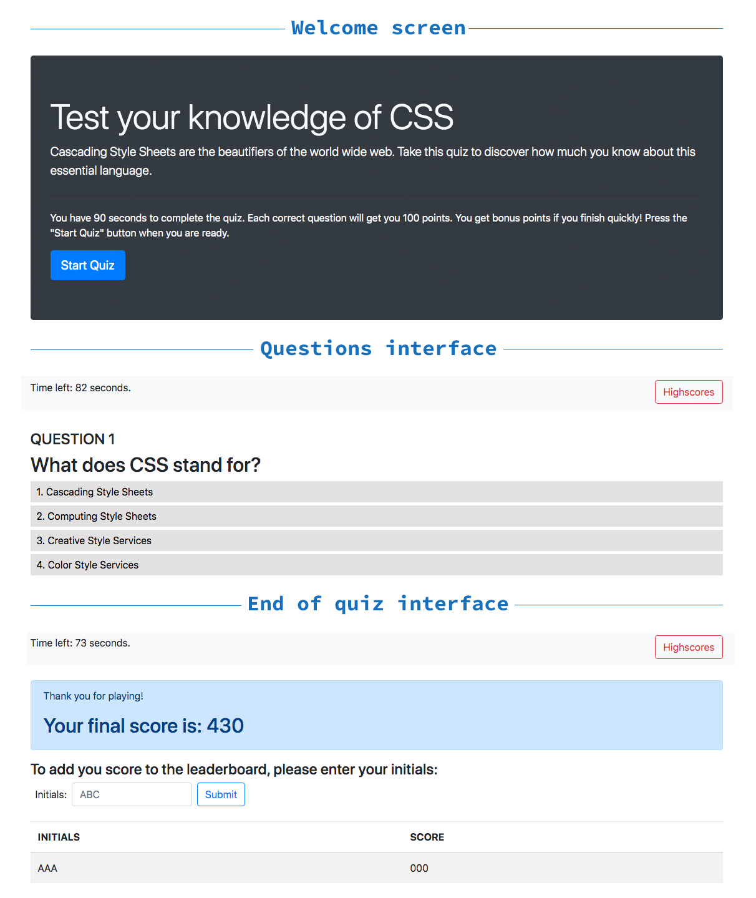

# Interactive CSS Quiz

***Author: Enid Soto***

This application is a timed quiz to test the user's basic knowledge of CSS. 

## Purpose

The purpose of the project was to make a functional application using pure javascript. It applies a few things learned in the UM Full Stack Developer Bootcamp 2019-2020, such as event listeners, timers, storing in localStorage, and custom functions.

## Technologies used

The application uses *Bootstrap 4,* javascript, and a few lines of custom css.

## Functionality

1. The user is greeted by a welcome screen where they can find the quiz subject, the quiz rules, and a start button.
2. When the "Start Quiz" button is pressed, it triggers the following:
   * A timer starts running at the top of the screen.
   * The first question is displayed.
3. The application will wait until an answer is clicked before displaying the next question. The user will see a green message if the answer is correct, and a red message if the answer is wrong. 
4. The timer will stop running when the user has anwered all the questions, or if the timer reaches 0 (zero) seconds.
5. The user will get bonus points if they answer all the questions before time runs out.
6. After the quiz is completed, the user can see their final score, and they have the option to add their score and initials to the leaderboard.

## User interface

## Link to the deployed application

You can find the deployed application [here](https://enma1009.github.io/css-quiz/)
